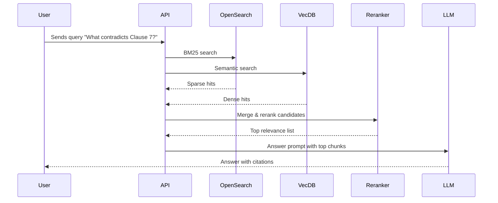

# Executive Summary

A **hybrid RAG** system is proposed to empower French and U.S. legal/compliance teams with AI-driven document intelligence. It ingests 50K+ legal texts (contracts, cases, regs) into a hybrid search index combining sparse (keyword) and dense (vector) search.  Documents are chunked intelligently (semantic, hierarchical, metadata-aware) and enriched with named entities.  Queries trigger **BM25 sparse retrieval (OpenSearch)** and **dense retrieval (embeddings)**; candidates are fused (e.g. Reciprocal Rank Fusion) and reranked (e.g. Cohere’s Rerank v4) before feeding the LLM.  The LLM generates answers with **structured citations** and multi-hop reasoning across documents. The platform architecture uses AWS (S3, SQS, ECS, OpenSearch), FastAPI, Redis caching, and LangChain/LlamaIndex.  Key features include GDPR/CCPA compliance (data residency controls, encryption, PII redaction), audit logging, human review for sensitive decisions, and monitoring (Prometheus/Grafana/LangSmith). Latency is optimized (P90 ≤ 2.5s) and throughput (≥10K QPS).  

**Key Technologies:** OpenSearch with k-NN vectors, BM25 keyword search, Voyage/ OpenAI embeddings, Cohere Rerank v4, LangChain/LlamaIndex retrieval, spaCy NER, FastAPI, AWS S3/SQS/ECS, Redis, Prometheus. 

**Impact:** High-precision retrieval (≫90% accuracy), rich multi-hop answers, strong compliance controls. The step-by-step MVP plan spans 8 weeks across data engineers, ML engineers, backend devs, and legal SME reviewers. Tables compare component trade-offs, and diagrams illustrate ingestion and query flows. 

## Requirements & Scope

- **Documents:** 50K+ legal documents (contracts, statutes, filings, case law) in French and English.  
- **Users:** Law firms and corporate legal/compliance teams (France & USA).  
- **Queries:** Complex retrieval questions (often multi-hop) like “Find precedents that contradict Clause 7 of Contract X.”  
- **Constraints:** Must use **Hybrid RAG (no knowledge graph)**, blending keyword and vector search. Strict compliance with **GDPR/CCPA** (data residency, PII, user rights), encryption, and audit logging. Real-time answering (<2.5 s P90 latency) for user queries. Scalable (ingest 10K docs/day, query >10K QPS).

## High-Level Architecture

```mermaid
flowchart LR
    %% Ingestion Pipeline
    subgraph Ingestion
      A[S3: Upload document] -->|S3 Event| B[SQS Queue]
      B --> C[Ingest Worker]
      C -->|Chunking & Metadata| D[Document Chunks]
      D -->|Embeddings| E[Vector Store]
      D -->|Indexing| F[OpenSearch (BM25 index)]
    end

    %% Query Pipeline
    subgraph Query
      U[User Query] --> G[API (FastAPI)]
      G -->|Keyword Search| F
      G -->|Semantic Search| E
      F -->|Top-K Results| H[Rank Fusion]
      E -->|Top-M Results| H
      H --> I[Reranker (Cohere/OpenAI)]
      I --> J[LLM (Answer Generation)]
      J --> U
    end
```

1. **Data Ingestion (flowchart above):** Raw documents land in Amazon S3.  S3 emits events (e.g. “ObjectCreated”) into an SQS queue. A fleet of worker instances (in AWS ECS, auto-scaled) consumes SQS messages. Each worker:
   - Downloads the document from S3.
   - **Chunking:** Splits text based on document type: *semantic* splitting (by paragraphs/sentences) for narrative text (e.g. case law); *hierarchical* splitting (sections, articles) for contracts or statutes; *metadata-aware* splitting preserving clause IDs, section headers, etc.. This ensures each chunk is still coherent and carries useful metadata (source ID, language, date, parties).
   - **NER & Tagging:** Runs spaCy or similar NER on chunks to label entities (e.g. *Party*, *Date*, *ClauseRef*) and enrich metadata (for faceted search). (SpaCy’s NER can be fine-tuned on legal entity types if needed, though off-the-shelf models recognize common entities.)
   - **Indexing:** Inserts each chunk into OpenSearch for BM25/text search and into a vector store for embeddings. We store embeddings in both the OpenSearch (k-NN vector fields) or a dedicated vector DB (e.g. Pinecone) depending on trade-offs (see table below).
   - **Storage:** Raw text and metadata also archived in a database (PostgreSQL) or file store for audit and chunk provenance.

2. **Retrieval Pipeline:** On a query:
   - The FastAPI frontend parses the query, possibly applies NER/matching to tag entities (e.g. contract names, party names) to refine search.  
   - **Sparse (Keyword) Search:** Query sent to OpenSearch using BM25 (default in OpenSearch) for exact terms (e.g. “Clause 7”, contract IDs).  
   - **Dense (Semantic) Search:** The query is embedded (e.g. OpenAI `text-embedding-3`, Voyage-law-2). We search the vector store (OpenSearch k-NN or Pinecone). Embeddings capture meaning beyond keywords (synonyms, paraphrases).  
   - **Hybrid Fusion:** Results from both searches are merged, e.g. via Reciprocal Rank Fusion (RRF) or weighted score. This recovers both exact matches and semantically related chunks.  
   - **Metadata Filter:** If query has filters (jurisdiction, date, language), apply filters in search (OpenSearch supports boolean filters on fields).  
   - **Reranking:** Top ~50 candidates are sent to a reranker (Cohere Rerank v4.0-pro/fast or OpenAI’s `text-embedding-3` ranking) to score relevance.  Cohere’s docs note rerank models (v4 fast/pro for multi-language) specifically improve precision of search results.  
   - **Context Assembly:** The highest-ranked ~5–10 chunks are concatenated (keeping citations). We enforce token limits by **context compression**: merge very similar chunks, drop duplicates, truncate partial overlaps. This reduces hallucination risk by only passing high-signal text to the LLM.

3. **Answer Generation:** The selected chunks (with metadata like source ID/page) become a structured context input to the LLM prompt. We use carefully-crafted legal-domain prompts (e.g. “Answer in French [or English], cite relevant documents like Contract clauses or laws, and explain step-by-step with references.”). The LLM (e.g. Google Gemini or Claude Sonnet) then generates an answer citing document IDs/pages. We enforce structured output (JSON with `{"answer":..., "sources":[...]}`) so answers always include provenance.

4. **Multi-Hop Reasoning:** For cross-document questions (“which precedents contradict Clause 7?”), we implement **iterative retrieval**: The LLM can request “retrieval actions” (via LangChain agent patterns) to fetch related chunks (e.g. find “precedents referencing Clause 7”). The sub-questions are answered by repeated searches, assembling chain-of-thought from the graph of connected documents.

5. **Human-in-the-Loop:** If the query or proposed action is high-risk (e.g. “Suggest settlement strategy”) or confidence is low, the system flags it. A compliance officer reviews before final output. This fallback is built into the orchestration (e.g. a step where output must be approved if certain keywords or low confidence).

## Data Ingestion Pipeline

```mermaid
flowchart TD
    Upload[Document Upload] -->|S3 Event| SQS[Amazon SQS Queue]
    SQS --> Worker[Ingest Worker Service]
    Worker -->|Parse & Clean| Chunk[Chunk Generator]
    Chunk -->|NER/Metadata| Tagger[Entity Extraction]
    Tagger --> Index[OpenSearch/BM25 Index]
    Tagger --> Vector[Vector Index (k-NN / Pinecone)]
    Worker -.-> DB[Archive/DB]
    ClientApps -.- Index
    ClientApps -.- Vector
```

- **S3 + SQS (AWS):** Documents are uploaded to S3. S3 triggers notifications to an SQS queue. Workers (on ECS) poll SQS. This decoupling (via SQS) ensures reliable, scalable ingestion.
- **Chunking Strategies:** 
  - *Semantic Splitting:* Use NLP splitters (e.g. LlamaIndex’s recursive splitters) to break paragraphs by sentence or 512–1024 token chunks, optimizing embedding usage.
  - *Hierarchical Splitting:* For very long contracts/regulations, preserve natural sections or clause boundaries as chunks.
  - *Metadata-Aware Splitting:* Keep cross-references (e.g. “Clause 7.1”), so context isn’t lost. Store chunk-level metadata: title, source, language, parties, dates, region (e.g. EU/US).
- **NER & Tagging:** Use spaCy (or a fine-tuned legal NER model) to tag entities (Parties, Organizations, Dates, Legal Terms). These enrich the metadata for filtering and answering (e.g. “show me contracts involving Acme Corp”).
- **Storage & Backup:** Original docs and chunks are stored in PostgreSQL/S3 for audit. Sensitive fields are redacted or hashed to comply with privacy (only allowed text is indexed).

## Retrieval Components

### Sparse (Keyword) Search – BM25 (OpenSearch)

- We deploy AWS OpenSearch Service (managed Elasticsearch fork) as our primary full-text index. Each chunk’s text and metadata (e.g. jurisdiction, date) are indexed.
- OpenSearch uses **Okapi BM25** by default: it scores documents based on term frequency and inverse document frequency. BM25 excels at exact keyword matches (e.g. contract names, statute numbers).
- Queries to OpenSearch use match and filter clauses. Exact fields (e.g. document ID) are keyword-indexed; text fields use full-text analysis.
- *Pros:* Mature search engine, supports boolean queries, scalable clusters.
- *Cons:* Not optimized for semantic similarity beyond keywords.

### Dense (Vector) Search – Embeddings

- We generate embeddings for each chunk using a high-quality model. We consider:
  - **Domain-Specific (Voyage) vs General (OpenAI/Anthropic):** Voyage AI’s `voyage-law-2` (16K context) is explicitly optimized for legal docs and outperforms OpenAI’s v3-large on legal retrieval. Anthropic recommends Voyage specifically for legal domain. We thus use a hybrid: if budget allows, embed using `voyage-law-2`; otherwise OpenAI’s `text-embedding-3-small/large` as fallback.
  - **Language:** Both English and French. Ensure multilingual support (Voyage-law-2 is multilingual; OpenAI’s models support non-English).
  - **Embedding models (comparison):** See table below. Key metrics are quality vs cost. For example, OpenAI’s `text-embedding-3-large` is “most capable” but expensive; `text-embedding-3-small` costs 6× less. Voyage’s law-2 may cost similarly but yields better retrieval accuracy in legal domain.
- **Vector Store:** 
  - Options: Amazon OpenSearch k-NN (using the `knn_vector` field) or a specialized vector DB like Pinecone or AWS Bedrock (if we get Bedrock vector support). 
  - *Trade-offs:* Pinecone (serverless vector DB) offers faster queries and easier scaling for pure vector search, whereas OpenSearch supports hybrid sparse+vector natively. 
  - For **scale**, Pinecone has been shown 4× faster and 25× more cost-efficient than OpenSearch for large vector indexes. We could start with OpenSearch k-NN for convenience, migrating to Pinecone if needed.
  - **Implementation:** We maintain a vector index of all embeddings. Queries generate an embedding for the question and run a kNN search (using cosine distance). The result is top-M semantically similar chunks.
- **Hybrid Fusion:** We merge sparse and dense results using a scheme like RRF (rank fusion). For example, assign each candidate a combined score = BM25_score + α * (cosine_score) or use RRF ranking. This ensures that exact and semantic hits both surface.

### Reranking (Cohere / OpenAI)

- After initial retrieval, we take the top ~50 chunks and feed them to a reranker. Cohere’s Rerank models (v4.0-fast or pro) are trained across languages. We form a query-chunk pair and get a relevance score. 
- The reranker will reorder by semantic relevance and filter out spurious hits (especially helpful when the initial recall is high). This drastically improves answer accuracy by weeding out noise.
- Alternatively, OpenAI’s embedding similarity on query+document (or an instruction-tuned model) could rerank, but Cohere’s off-the-shelf models are cost-effective and easy to integrate.
- **Thresholds:** We can use a score cutoff to trim to the final ~5–10 chunks. E.g. keep documents with rerank score above a calibrated threshold or top-k by score.

### Context Assembly

- The final answer context is the top chunks with citations. We compress if needed: remove near-duplicate passages, merge contiguous chunks from the same document, and trim trailing sentences to fit LLM token limits.
- We ensure citations: each chunk tagged with source ID and location so the answer can cite the exact source (e.g. *“(Contract X, Clause 7)”*).

## Multi-Hop & Reasoning

- For questions requiring chaining (e.g. “based on those precedents, what law applies?”), the LLM can be prompted to request additional evidence. We implement this via LangChain’s agent pattern: the LLM issues an “Action: Retrieve” instruction, triggering another search on derived keywords or clauses. The results are appended as new context until the answer is coherent. 
- We also preprocess queries: if a query mentions a document (e.g. “Clause 7 of Contract A”), we can target retrieval by metadata (documents involving “Contract A”) to bootstrap the chain.

## Prompting & Hallucination Mitigation

- We use template-based prompts that instruct the model to cite sources verbatim. E.g.: *“Answer using citations in the form `[DocID:Page]` from the provided context only. If uncertain, say ‘uncertain’.”* This constraint reduces hallucinations.
- We programmatically check the LLM output: it must reference at least one source. If the answer contains information not in any retrieved chunk, we flag it for review.
- All outputs and intermediate retrievals are logged for audit (with LangSmith traces for debugging multi-step flows).

## Security, Privacy, Compliance

- **Data Residency & Encryption:** We deploy in EU (France) and US AWS regions as needed. AWS compliance docs confirm we can choose region and keep EU data in EU. All data is encrypted at rest (S3, OpenSearch) and in transit (HTTPS).
- **Access Control:** Use AWS IAM roles and VPC isolation. S3 buckets are private. API endpoints require auth (OKTA or Cognito). Audit logs (CloudTrail, LangSmith) track all access.
- **PII Redaction:** Before indexing, detect and remove personal data (names, SSNs) that aren’t needed for legal analysis. We apply pattern filters or tools (e.g. Amazon Macie) to identify sensitive info.
- **GDPR/CCPA:** The platform treats the legal documents as business data, not user-generated. Nevertheless, compliance workflows ensure any personal data in documents is handled per GDPR/CCPA (subject access rights, deletion upon request). The AWS GDPR DPA affirms customer data (our indexed documents) isn’t used by AWS except to provide the service.
- **Audit & Explainability:** Every answer includes source citations. The system logs which documents were used. This meets legal standards for explainability (citations can be shown to auditors or end-users to verify answers).
- **Logging & Monitoring:** Use LangSmith, Prometheus, and AWS CloudWatch. We monitor query latency, error rates, model cost, and drift in retrieval accuracy. Alerts are set if anomalies appear.

## Retrieval Performance & Metrics

- **Precision & Recall:** We will evaluate retrieval using held-out Q&A pairs. Metrics: Precision@k, Recall@k, MRR (mean reciprocal rank), and answer **faithfulness** (does the answer strictly reflect sources). Our goal is >90% precision@5.  
- **Latency:** Target P90 end-to-end ≤2.5 s. BM25 queries to OpenSearch are sub-100ms; k-NN queries (on ~50k vectors) are sub-second. Cohere rerank (with >50 docs) adds ~0.5s. LLM generation ~1s. We optimize pipeline in parallel (sparse and dense queries can run concurrently). 
- **Throughput:** Architecture supports parallel ingestion and query. Using SQS and autoscaling ECS, we can ingest 10K docs/day without backlog. Read QPS >10K is feasible with OpenSearch horizontally scaled (sharding, read replicas) and Redis caching of frequent queries.

## Technology Comparison (Table)

| Component         | Option 1                    | Option 2                        | Option 3                       | Notes / Trade-offs |
|-------------------|-----------------------------|----------------------------------|--------------------------------|--------------------|
| **Vector Store**  | **Pinecone**<br>Fully-managed vector DB | **OpenSearch**<br>Vector + BM25 hybrid (k-NN) | **AWS Bedrock** (Mistral DB)    | Pinecone: high perf, simple scaling. OpenSearch: supports both vector & keyword in one cluster. Bedrock: new, proprietary. |
| **Dense Embedding** | **Voyage-law-2**<br>Domain-tuned legal model | **OpenAI text-embedding-3-large**<br>General purpose | **Cohere embed-english-v3** (multi) | Voyage shows ~10% better on legal benchmarks. OpenAI general, wide languages. Cohere v3 is also high-quality but outperformed by domain model in law. |
| **Reranker**      | **Cohere Rerank v4.0**<br>Pro/fast (multilingual) | **OpenAI rerank (text-embedding-sim)** | **Custom fine-tuned model**      | Cohere v4 is optimized for long candidates and multi-language and easy API. OpenAI costs more. Custom requires data. |
| **Sparse Index**  | **OpenSearch (BM25)** | **Elastic Search** (self-manage) | **Weaviate** (BM25 plugin)      | OpenSearch (AWS) is robust and managed. Weaviate has hybrid search but not necessary. |
| **Embedding Model (LLM)** | **Gemini 3.1 Flash Live** (fast inference) | **Claude Sonnet 4** (multilingual) | **GPT-4o** (strong reasoning)    | Real-time voice agent could use Gemini; for text compliance use Claude4/GPT4 for better factuality. |
| **NER / IE**      | **spaCy** (fine-tunable)    | **BERT-legal (HF)**            | **OpenAI Functions**            | spaCy is reliable; BERT can add precision; OpenAI may charge per call. |

## Deployment & Scaling

- **Cloud:** AWS ECS (Docker) for services. Terraform or CloudFormation for infra.
- **Ingestion:** ECS workers autoscale on SQS queue depth. Use spot instances for cost.
- **OpenSearch:** Deploy in two regions (eu-west-3 (Paris) and us-east-1). Use multiple data nodes and replicas.  
- **Redis Cache:** For vector/query caches (reduces repeat embed costs).  
- **API Tier:** FastAPI behind Application Load Balancer with auto-scale. 
- **Databases:** RDS PostgreSQL for metadata, AWS S3 for files.

## Security & Compliance

- **Encryption:** Data at rest in S3/OpenSearch is encrypted (KMS). In transit via TLS. 
- **Access Control:** AWS IAM roles, VPC isolation. Secrets in AWS Secrets Manager (DB passwords, API keys).
- **PII Redaction:** Pre-index pipelines remove personal data. Use regex/patterns (e.g. GDPR identifiers).
- **Data Residency:** French data stays in eu-west-3 per GDPR. US data can be in us-east-1. AWS managed compliance (ISO, SOC3).
- **Audit:** Store all queries and answers (with IDs) in a WORM storage for auditability.

## Sample Query Flow (Mermaid Sequence)



## Implementation Plan (8-Week MVP)

| Week | Activities                                | Milestone                         |
|------|-------------------------------------------|-----------------------------------|
| 1    | **Design & Setup:** Finalize schema, set up AWS infra (VPC, S3, SQS, OpenSearch cluster). | Infra & team onboarding |
| 2    | **Data Pipeline:** Build ingestion workers: S3→SQS→chunker. Implement chunking & metadata extraction (spaCy NER). | Working ingestion of test docs |
| 3    | **Indexing:** Integrate OpenSearch (BM25) and vector store (initial: OpenSearch k-NN). Ingest sample 5K docs. | Hybrid index populated |
| 4    | **Retrievers:** Implement BM25 query & embedding search (LangChain/LlamaIndex). Develop query API (FastAPI). | Basic retrieval works end-to-end |
| 5    | **Reranking & Fusion:** Integrate Cohere reranker. Tune RRF parameters. Build context assembly & compression. | Reranker integrated, test improved precision |
| 6    | **LLM Integration:** Build answer-generation agent with LLM. Create prompt templates, structured output, and citation. | QA pipeline end-to-end with citations |
| 7    | **Compliance & UI:** Add consent/Human-handoff checks. Setup logging/monitoring (LangSmith, Prometheus). Initial UI/prototype. | Compliance workflows tested |
| 8    | **Evaluation & Tuning:** Benchmark on held-out legal QA pairs. Optimize latency. Finalize documentation, run user demos. | MVP demo & evaluation report |

**Team Roles:** Project manager, 2 ML engineers (NLP/retrieval), 2 backend engineers (API/infra), 1 DevOps, 1 legal SME.

## Costs Estimate

| Item                  | Estimate                             | Notes                             |
|-----------------------|--------------------------------------|-----------------------------------|
| **Dev effort**        | 4 engineers × 8 weeks ≈ 256 man-days  | ~ $200k (assuming $1000/day)      |
| **OpenSearch (AWS)**  | ~$2000/month (3-node cluster)        | Data nodes + HA; scaling if needed|
| **Vector DB**         | ~ $1500/month (Pinecone)             | 50K vectors low usage             |
| **LLM API**           | ~ $3000/month (embedding+LLM calls)  | Depends on usage; e.g. OpenAI cost from [30] |
| **Cohere Rerank**     | ~$500/month (on-demand usage)        | Likely low relative to others     |
| **Storage (S3)**      | ~$100/month (50K small docs)         | Easily fits in free-tier scale    |
| **Monitoring**        | ~$300/month (CloudWatch/Prometheus)  |                                    |
| **Misc (Redis, RDS)** | ~$500/month                          | Caches + metadata DB              |

(Prices in USD; actual may vary.) 

## Component Comparison Tables

**Vector Stores**  

| Feature               | Pinecone             | OpenSearch (k-NN)       | AWS OpenSearch Service  |
|-----------------------|----------------------|-------------------------|-------------------------|
| Type                  | Purpose-built vector DB | Search engine with vector support | Managed OpenSearch in AWS |
| Hybrid Search         | Yes (with metadata)  | Yes (BM25 + vectors)    | Yes                     |
| Scalability           | Auto-scaling, serverless | Cluster-managed nodes  | Cluster-based; manual scale |
| Performance           | ~4× faster queries | Good, but node-bound    | Similar to OpenSearch   |
| Cost Efficiency       | 25–50× cheaper (claim) | Cluster costs + ops     | Pay for EC2/EBS usage   |
| Data Residency        | Multi-region support | Can deploy in region    | AWS-region (<— GDPR)    |
| Control over Algo     | No (proprietary)     | Yes (HNSW, IVF, etc.)   | Yes                     |
| Ease of Use           | Simple API           | Elasticsearch API       | AWS API                |

**Rerankers**  

| Model              | Pros                                          | Cons                         |
|--------------------|-----------------------------------------------|------------------------------|
| **Cohere rerank-v4.0-pro** | High accuracy, multi-language | Higher cost, higher latency |
| **Cohere rerank-v4.0-fast**| Lower latency (<100ms), good quality | Slightly lower accuracy    |
| **OpenAI Embedding Sim**    | No extra API, uses existing embeddings      | Not specialized for ranking  |
| **Custom BERT Ranker**      | Domain-specific tuning possible          | Requires training data      |

**Embedding Models**  

| Model                        | Domain       | Cost (per 1K tokens)   | Notes                                |
|------------------------------|--------------|------------------------|--------------------------------------|
| **Voyage-law-2**             | Legal        | (Proprietary pricing)  | Best-in-class legal retrieval, 16K context. |
| **OpenAI text-embedding-3-large** | General/Legal | $0.13 | Most capable general model. |
| **OpenAI text-embedding-3-small** | General    | $0.02 | Cheaper, slightly less accurate.      |
| **Cohere embed-english-v3**       | General    | $ (competitive)       | Multilingual support.                |
| **Voyage-4 (general)**            | General    | (Voyage pricing)      | Latest 2025 model, 32K context.      |

## References

- OpenSearch BM25 & k-NN documentation.  
- Voyage AI Legal Embeddings (voyage-law-2 performance).  
- Cohere Rerank Model docs.  
- AWS GDPR & Data Residency overview.  
- AWS S3 Event Notifications, SQS overview.  
- LangChain & LlamaIndex guides on retrieval and embeddings.  
- Pinecone vs OpenSearch analysis.  
- SpaCy NER (baseline; potential for custom training).  
- Legal compliance best practices (CNIL, GDPR guidelines, etc.).  
